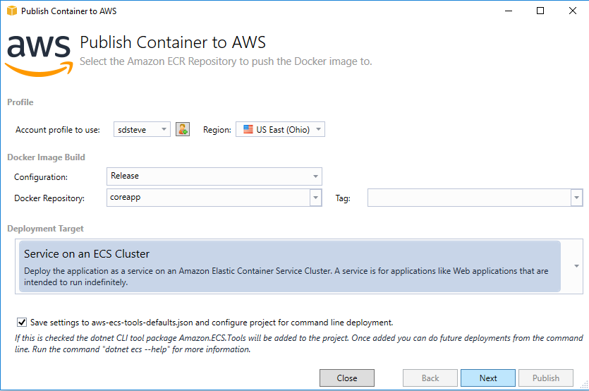
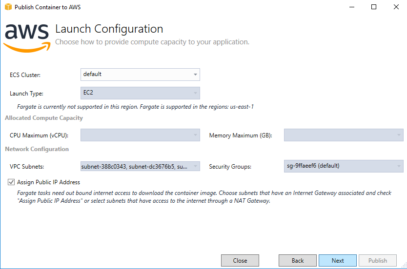
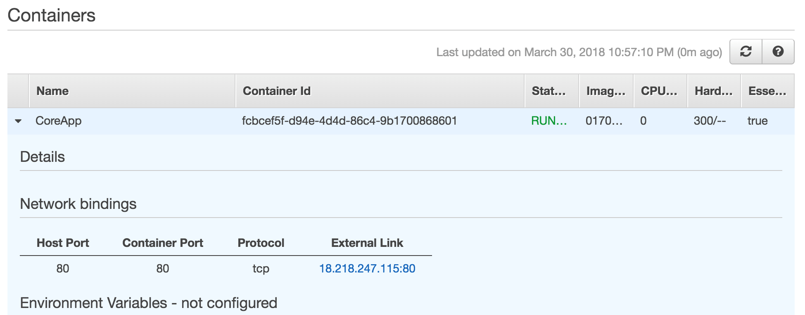
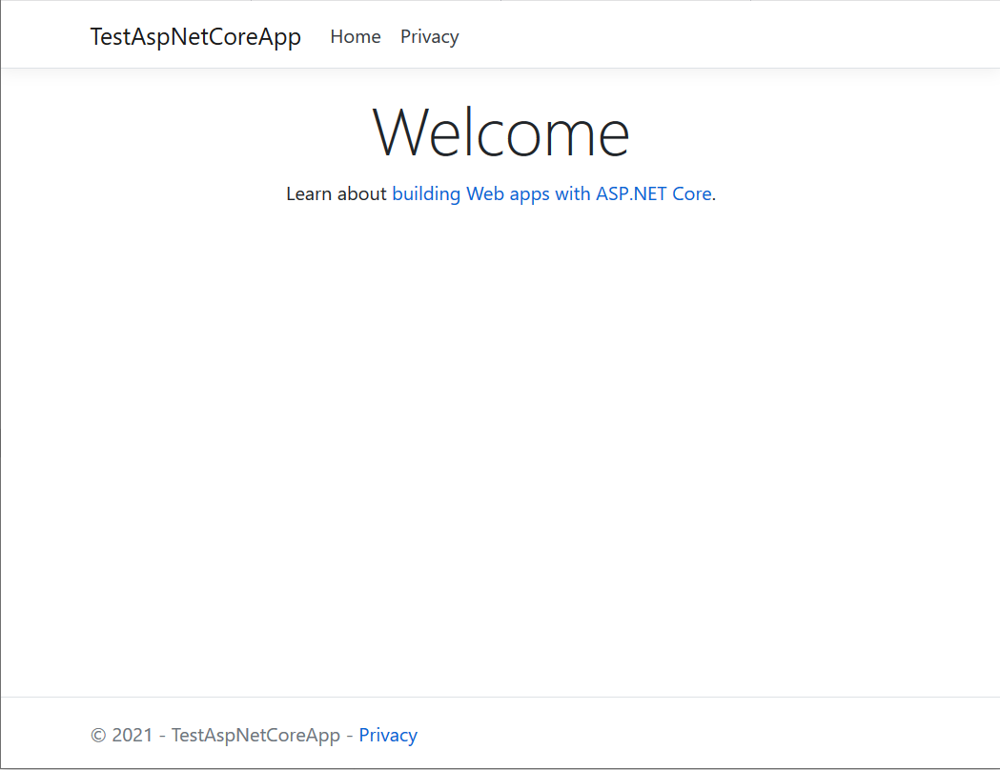

# Deploy an ASP.NET Core Application to Windows Containers Using Amazon Elastic Container Service (ECS)

## Overview

This guide demonstrates how to use [Amazon Elastic Container Service](https://aws.amazon.com/ecs/) to host a default ASP.NET Core website, built and deployed using Visual Studio on Windows.

## Introduction

With the ever-growing complexity of modern workloads, the mutual challenges of application scaling and deployment have been greatly simplified by the introduction of [Docker](https://www.docker.com/), an open source platform that provides a standard approach to application containerization.

By allowing applications to be packaged and deployed alongside their dependencies, while keeping them isolated from other applications, containers have not only become a standard deployment approach for new applications---and, in particular, applications based on micro-services---but they've also become popular mechanisms for packaging and isolating legacy applications.

[Amazon Elastic Container Service](https://aws.amazon.com/ecs/) (ECS) is a container orchestration service that simplifies running and scaling containerized applications on AWS.

## Modules

1. Setup Development Environment
1. Configure ECS cluster
1. Create ASP.NET Core web application
1. Deploy Application to ECS

### Prerequisities

- AWS Experience---Beginner

- Time to Complete---35 mins

- Cost to Complete---Each service used in this architecture is eligible for the AWS Free Tier. If you are outside the usage limits of the Free Tier, completing this learning path will cost you less than \$0.25\*.

- Tutorial Requirements---To complete this learning path, you will need:\
    ✓ An AWS Account\*\*

    ✓ An IAM user with access key credentials\*\*\*\
    ✓ A Docker Account\*\*\*\*\
    ✓ Visual Studio 2019 for Windows

\*This estimate assumes you follow the recommended configurations throughout the tutorial and terminate all resources within 24 hours.

\*\*Accounts that have been created within the last 24 hours might not yet have access to the resources required for this learning. If you don't have an account visit <https://aws.amazon.com> and click **Sign Up**.

\*\*\* You must have a set of valid AWS credentials, consisting of an access key and a secret key, which are used to sign programmatic requests to AWS. You can obtain a set of account credentials when you create your account, although we recommend you do not use these credentials and instead [create an IAM user](http://docs.aws.amazon.com/IAM/latest/UserGuide/Using_SettingUpUser.html) and use those credentials.

\*\*\*\* If you don't have a Docker account, visit
<https://www.docker.com> and click **Create Docker ID**.

## Module 1: Setup development environment

In this module you'll configure your development environment for working with .NET Core and Docker. These instructions provide options for working with Visual Studio 2017 for Windows.

- Time to Complete---15 mins

### Step 1: Setup Visual Studio for Windows

First of all, you will need to ensure the following components are installed:

a. The **.NET SDK 5.x**(recommended) or **.NET Core SDK 3.x** for Windows:\
   <https://dot.net>

b. Visual Studio 2017 or 2019 (we recommend Visual Studio 2019)

c. The AWS Toolkit for Visual Studio:\
   <https://aws.amazon.com/visualstudio/>

### Step 2: Setup Docker on Windows

You will then need to ensure Docker for Windows is installed:

a. Download [Docker for Windows](https://store.docker.com/editions/community/docker-ce-desktop-windows) and install the latest stable version of Docker.

b. Run the installer and login with your Docker credentials.

c. Once installation has finished you can verify the installation by opening a command prompt and running the following command:

```bash
docker -v
```

## Module 2: Configure an ECS Cluster

In this module we will configure a cluster for hosting our application using Amazon Elastic Container Service (ECS) cluster.

- Time to Complete---5 mins

### Create the ECS Cluster

1. Open the *AWS Management Console* in a web browser and search for ECS. Click the search result to open the ECS home page.\


1. Under *Amazon ECS* navigate to *Clusters* and then click **Create Cluster** to start the Cluster Creation Wizard.

1. Under *Select cluster template* choose **EC2 Windows + Networking** and then click **Next step**.

1. In the *Configure cluster* section enter the following field values:

    a. *Cluster name*: TestWindowsCluster

1. In the *Instance configuration* section enter the following field values:

    b. *Provisioning model*: On-Demand Instance

    c. *EC2 instance type*: t2.medium

    d. *Number of instances:* 1

    e. *EBS storage (GiB)*: 50

    f. *Key pair:* None - unable to SSH

1. Leave the default settings under the *Networking* and *Container instance IAM role* sections, and then click **Create**.

> Once the services are ready, all the tasks in the AWS Management
> Console window will turn green.
>
> Now you've successfully created an ECS cluster, it's time to create a
> basic ASP.NET Core application to host in the cluster.

## Module 3: Create an ASP.NET Core Application

In this module we will create a default ASP.NET Core Web App using the Microsoft-supplied project template.

- Time to Complete---10 mins

### Step 1: Create Application in Visual Studio for Windows

If your development environment is Visual Studio 2019 on Windows, you can create an ASP.NET Core application as follows (Visual Studio 2017 users should follow the corresponding version of the New Project wizard) - 

1. Open Visual Studio and then create a new project by navigating to the *File* \> *New* \> *Project* menu item.

1. In the *Create a New Project* dialog, select *ASP.NET Core Web App C#* template.

1. Enter *TestAspNetCoreApp* in the **Name** field, and then click **Next**.

1. Select the *Framework*(.NET 5.0 or .NET Core3.1)

1. Select **Enable Docker** and the **OS** drop-down is set to *Windows*.

1. Click **Create** to complete the wizard.

The wizard creates all the files and configuration necessary for hosting an ASP.NET Core Web application in a container, although before deploying the solution, you'll need to edit the *Dockerfile* file to ensure it targets the same version of Windows Server used by the cluster.

The Cluster Creation Wizard currently uses Windows Server 2019, so you'll need to locate and open the *Dockerfile* in Visual Studio and then update all references of */dotnet/sdk:5.0* to */dotnet/aspnet:5.0-nanoserver-1809* or */dotnet/aspnet:3.1-nanoserver-1809* depending on the .NET version your application is running on. Your file should be similar to that shown below:

```dockerfile
FROM mcr.microsoft.com/dotnet/aspnet:5.0-nanoserver-1809 AS base
WORKDIR /app
EXPOSE 80
EXPOSE 443

FROM mcr.microsoft.com/dotnet/sdk:5.0-nanoserver-1809 AS build
WORKDIR /src
COPY ["TestAspNetCoreApp.csproj", "."]
RUN dotnet restore "./TestAspNetCoreApp.csproj"
COPY . .
WORKDIR "/src/."
RUN dotnet build "TestAspNetCoreApp.csproj" -c Release -o /app/build

FROM build AS publish
RUN dotnet publish "TestAspNetCoreApp.csproj" -c Release -o /app/publish

FROM base AS final
WORKDIR /app
COPY --from=publish /app/publish .
ENTRYPOINT ["dotnet", "TestAspNetCoreApp.dll"]
```

You can now build the solution by going to the *Build* menu and clicking
on **Build Solution**. Once the build has succeeded you are ready to
deploy the solution to ECS.

## Module 4: Deploy application to ECS

In this module we will deploy the ASP.NET Core application to ECS.

- Time to Complete---5 mins

### Step 1: Deploy using Visual Studio for Windows

If your development environment is Visual Studio 2017 or 2019 on Windows, you can deploy the ASP.NET Core application as follows:

1. Right click on the *TestAspNetCoreApp* project within the *Solution Explorer* window and then select **Publish Container to AWS...**

1. The *Publish Container* wizard will start. You can leave the settings on the default values, but ensure *Deployment Target* is set to **Service on an ECS Cluster**, and then click **Next**.\
\


1. On the *Launch Configuration* dialog change the *Launch Type* to **EC2**, and then click **Next**.\
\


1. Under *Service Configuration* you can create a new ECS Service, by leaving the default settings and clicking **Next**.

1. Leave the default settings on the *Application Load Balancer Configuration* dialog and click **Next**.

1. On the *Task Definition* dialog, click on *Task Definition:* **Create New**, *Container:* **Create New**  and set the
    **Hard Limit** to **500**, under *Port Mapping* update the **Host Port** to
    **8080**, leave the rest to default settings and then click **Publish**.

<details>
  <summary><i>Troubleshoot</i></summary>
  
  
  - If you're having trouble publishing the ASP.NET Core application due to docker issues, you may refer to the following.
 
     * https://stackoverflow.com/questions/58986352/docker-build-fails-always-with-error-hcsshimpreparelayer-failed-failed-in-wi
     * http://codebuckets.com/2020/08/01/nuget-restore-failing-in-docker-container/
</details> 
<br>

Publishing the ASP.NET Core application will take a couple of minutes to complete, and once it finishes the application will be almost be ready for testing.

However, before testing the application you will need to update the service's task definition to use the *NAT* network mode, since Windows containers don't currently support *bridge* networking.

To update the task definition's network mode, carry out the following steps:

1. In the AWS Management Console, navigate to ECS *Task Definitions*, select the checkbox next to the *TestAspNetCoreApp* task and then click on **Create new revision**.

1. Under *Network Mode* update the value to **\<default\>**, which uses NAT on Windows, and then click **Create**.

Finally, update the service to use the new task definition.

1. Select *Clusters* in the AWS Management Console's *ECS* screen.

1. Click on *TestWindowsCluster* to open the *Cluster definition* screen.

1. Under the *Services* tab click on **TestApNetCoreApp** to open the *Service definition* screen.

1. Click **Update** to edit the service definition.

1. Under *Task Definition*, update the *Revision* to **2 (latest).**.

1. Click **Next step**.

1. Click **Next step** on the *Configure network* screen.

1. Click **Next step** on the *Auto Scaling* screen.

1. Click **Update Service** on the *Review* screen.

The ECS service will automatically create a task based on the new definition, and once the new task enters a *Running* state, the application is ready for testing.

### Step 2: Test the Deployment

You are now ready to test the ASP.NET Core application in your browser.

To view the application, you'll need to retrieve the ECS service's public IP address from the AWS Management Console, which you can do by opening the *Task* screen which you'll find by clicking the task name under the *Tasks* tab of the *Service definition* screen.

The container's public IP address is then listed in the *Network bindings* section listed under *Containers*.



Click on the URL under the *External Link* section, and the ASP.NET Core site will load in your browser.



Congratulations, you have now deployed an ASP.NET Core application to Amazon Elastic Container Service!
