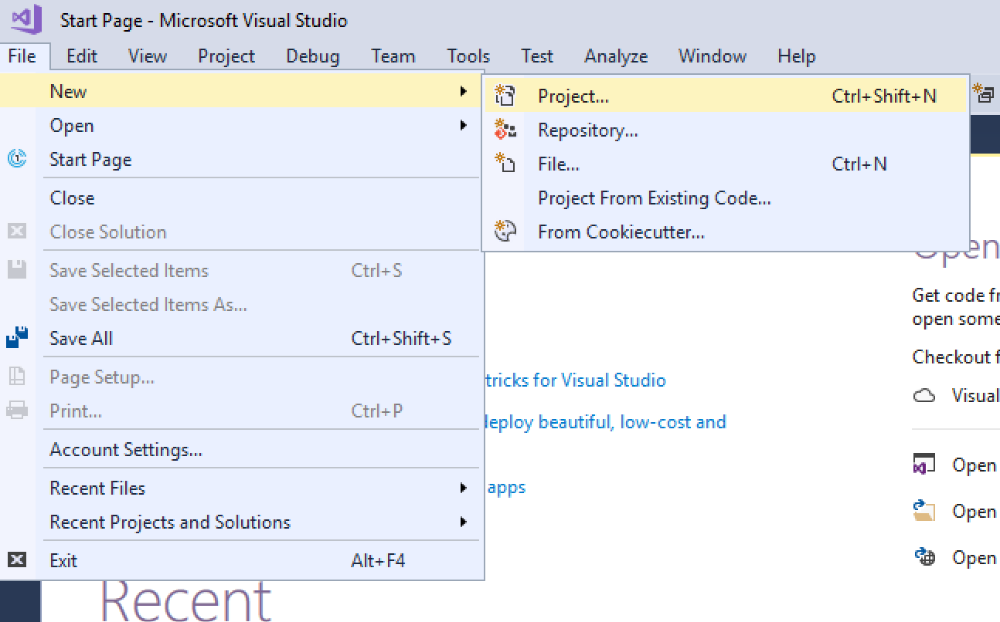
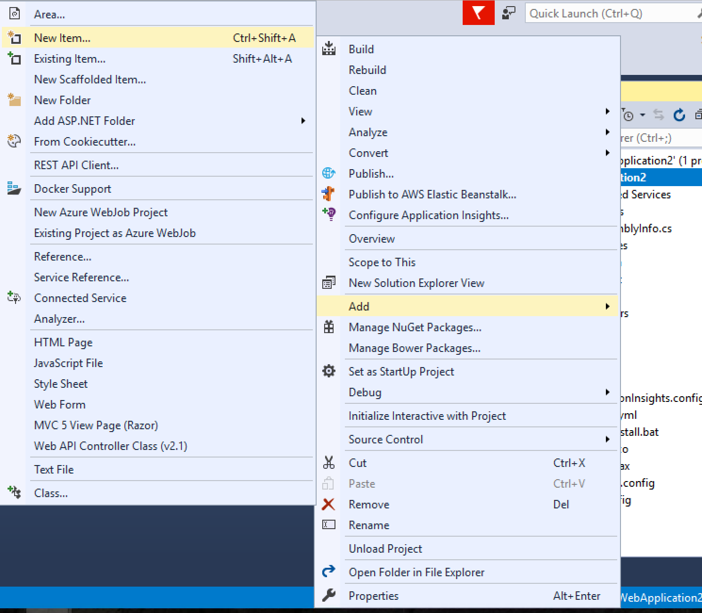

# Deploy an app to EC2

## Overview

This article will take common .NET development tools like Visual Studio
Community edition and Visual Studio Team Services (VSTS) and deploy an
application to an AWS EC2 instance via the AWS CodeDeploy service.

## Architecture


## Modules

1.  Create a ASP<span></span>.NET application
1.  Configure .NET application for [AWS CodeDeploy](https://aws.amazon.com/codedeploy/)
1.  Check-in to VSTS source control
1.  Setup AWS CodeDeploy
1.  Integrate VSTS and AWS CodeDeploy
1.  Test the Deployment

### Module 1: Create a ASP<span></span>.NET Application

#### Overview

In this module we will use Visual Studio Community edition to create a
.NET Core 2.0 MVC application.

#### Implementation Instructions

1.  Open Visual Studio
1.  Click File \> New \> Project...

    

1.  The project dialog window will popup. Select the "ASP<span></span>.NET Web
    Application" template under the Installed \> Visual C\# \> Web
    templates. Be sure to check the box that says "Create new Git
    repository."

    

1.  Select MVC.

    

### Module 2: Configure ASP<span></span>.NET application for AWS codedeploy 

#### Overview

Now that we have an ASP<span></span>.NET application let's add the files needed to allow AWS CodeDeploy to understand the deployment and configuration.
There are two files we will need to add:

1.  **Appspec.yaml** -- The application specification file is a YAML or
    JSON-formatted file used by AWS CodeDeploy to manage a deployment.
1.  Before-install.bat - a script that installs IIS and ASP<span></span>.NET 4.5
    features for IIS.

Implementation Instructions

1.  Create the appspec.yaml file by right clicking on the project \>
    Add \> New Item...

    

1.  Name the file appspec.yaml and click Add.
   
    

1.  Copy the following code, paste into the file and save.

    ```yaml
    version: 0.0
    os: windows
    files:
    - source: \
        destination: C:\inetpub\wwwroot
    hooks:
    BeforeInstall:
        - location: \before-install.bat
        timeout: 900
    ```

    > Note: If you are saving this in Visual Studio on a windows machine you
    > will need to do a "Save As..." and change the file encoding to the
    > following:

    

1.  Use the same process to create the before-install.bat

1.  Copy the following code, paste into the before-install file and
    save.

    ```
    REM Install Internet Information Server (IIS).

    c:\\Windows\\Sysnative\\WindowsPowerShell\\v1.0\\powershell.exe
    -Command Import-Module -Name ServerManager

    c:\\Windows\\Sysnative\\WindowsPowerShell\\v1.0\\powershell.exe
    -Command Install-WindowsFeature Web-Server

    c:\\Windows\\Sysnative\\WindowsPowerShell\\v1.0\\powershell.exe
    -Command Install-WindowsFeature web-asp-net45
    ```

### Module 3: Check-in to VSTS source control

#### Overview

Now that we have the code we want deployed to EC2, we need to check it
into a source control system. In this module we will add our code to
VSTS through the Team Explorer in Visual Studio.

#### Implementation Instructions

1.  With the ASP<span></span>.NET Core project open, click Team Explorer.
1.  In Team Explorer under "Push to Visual Studio Team Services" click
    "Publish Git Repo".

    

1.  You will see a message once the push is complete.
   
    

### Module 4: Setup AWS CodeDeploy

#### Overview

In this step we will create an application in CodeDeploy and a
deployment group.

#### Implementation Instructions

1.  From the AWS Console search for CodeDeploy.

    

1.  Click the Get Started Now button

    

1.  Chose the Sample Deployment and click Next.

    

1.  Choose In-place deployment and click Next.

    

1.  Change the instance type to Windows, select or create a key pair and
    click Launch instances.

    

1.  Name your CodeDeploy Application. Click Next.

    

1.  Select the sample application for Windows. This will deploy a
    generic sample application to your servers. We will overwrite it
    with the code we checked into VSTS. Click Next.

    

1.  We will create a new role. Click Next.

    

1.  For the Deployment Configuration we will use the default. Click
    Deploy.

    

1.  CodeDeploy will do the initial deployment and is ready to receive
    our application.

### Module 5: Integrate VSTS and AWS CodeDeploy

#### Overview

In this step we will create a VSTS build job that will deploy our
application to EC2 instances via CodeDeploy.

#### Implementation Instructions

1.  Open our repo in VSTS, click on the Builds and Releases tab. Click
    New.

    

1.  VSTS Git is our Source repo and we want to publish the master
    branch. Click Continue.

    

1.  Choose the ASP<span></span>.NET template and click Apply.

    

1.  Click the + symbol to add a new task.

    

1.  Search for the Copy files task and click Add. The task will go to
    the bottom of the list on the left.

    

1.  Click the Copy files task and update the parameters.

    

1.  Click the + symbol to add a new task. Search for the CodeDeploy task
    and click Add. The Task will go to the bottom of the list on the
    left. Update the parameters.

    

    > Note: Your first time you will need to install the AWS VSTS toolkit from
the Marketplace.

1.  Configure the Code Deploy task.

    

    

1.  Click Triggers and enable Continuous integration.

    

1.  Save the build.

### Module 6: Test the Deployment

#### Overview

In this module, we will deploy the code to the EC2 instances.

#### Implementation

1.  Make a change to your code and check it into VSTS which initiates a
    build. Once the build is complete you will be able to click through
    the various steps in the process.

    

1.  You can view your deployed application by getting the public DNS or
    IP address for the EC2 instance and to navigate to the site in a
    browser.

    

2.  You now have a working CI/CD pipeline that deploys an ASP<span></span>.NET
    application from source control to EC2.
