# Deploy an app to EC2

## Overview

This article will take common .NET development tools like Visual Studio
Community edition and Visual Studio Team Explorer and deploy an
application to an AWS EC2 instance via the AWS CodeDeploy service.

## Architecture


## Modules
1.  Create a New Project in Azure DevOps
1.  Create a ASP<span></span>.NET application
1.  Configure ASP<span></span>.NET application for [AWS CodeDeploy](https://aws.amazon.com/codedeploy/)
1.  Check-in to Azure DevOps source control
1.  Set up a Service role for EC2 instance
1.  Create an EC2 instance
1.  Set up a Service role for AWS CodeDeploy
1.  Setup AWS CodeDeploy
1.  Create an Amazon S3 bucket
1.  Integrate Azure DevOps and AWS CodeDeploy
1.  Test the Deployment


### Module 1: Create a New Project in Azure DevOps

#### Overview
In this module we will login to Azure DevOps to create a New Project for our application

> Note: You can also use an existing project if you have one.
#### Implementation instructions

1. Login to Azure DevOps using your credentials

    

1. Click New Project

    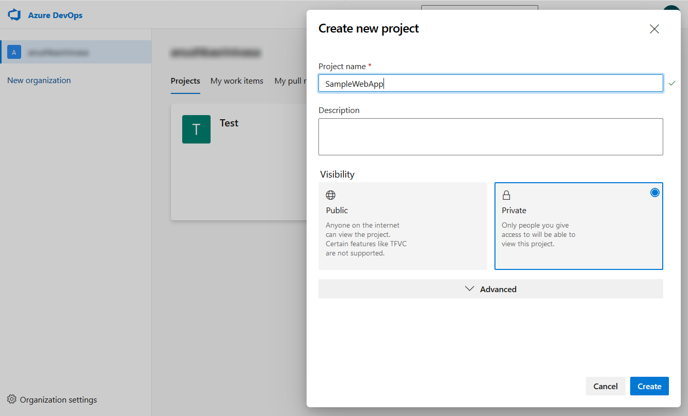

1. The project window will open 
1. Click on Repos > Files (This is the location where we will add our sample ASP<span></span>.NET application code later)
1. Select Visual Studio under Initialise main branch with a ReadME or gitignore
1. Click on Initialise

    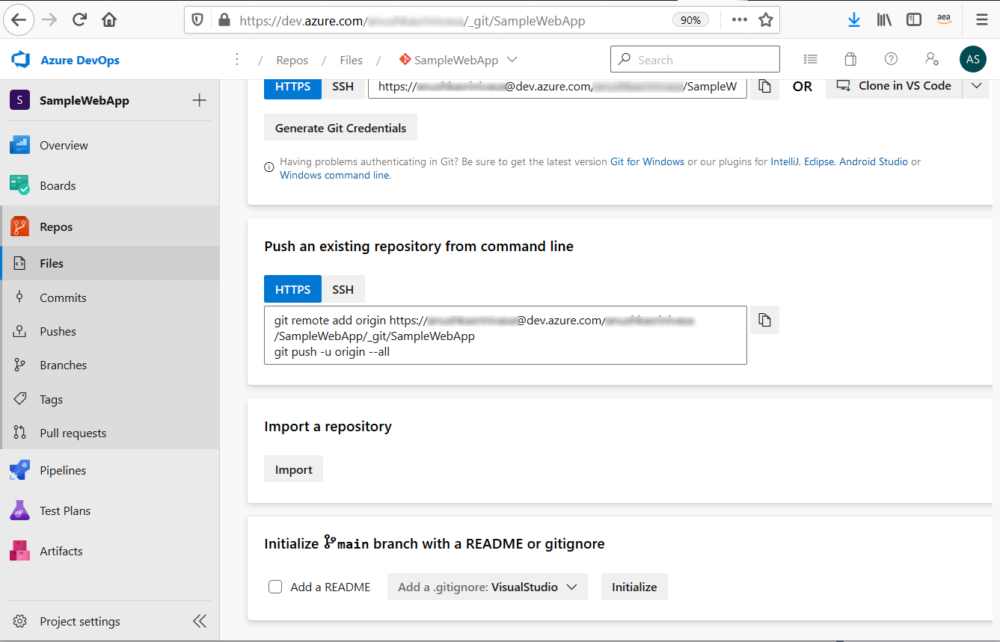


### Module 2: Create a ASP<span></span>.NET Application

#### Overview

In this module we will use Visual Studio Community edition to create a
ASP<span></span>.NET MVC 5 web application.

#### Implementation Instructions

1. Open Visual Studio
1. Click View > Team Explorer

    

1. Select Home > Projects and My Teams > Manage Connections

    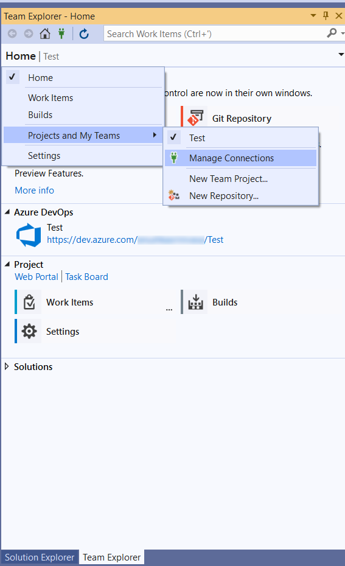

1. Select Connect to a Project

    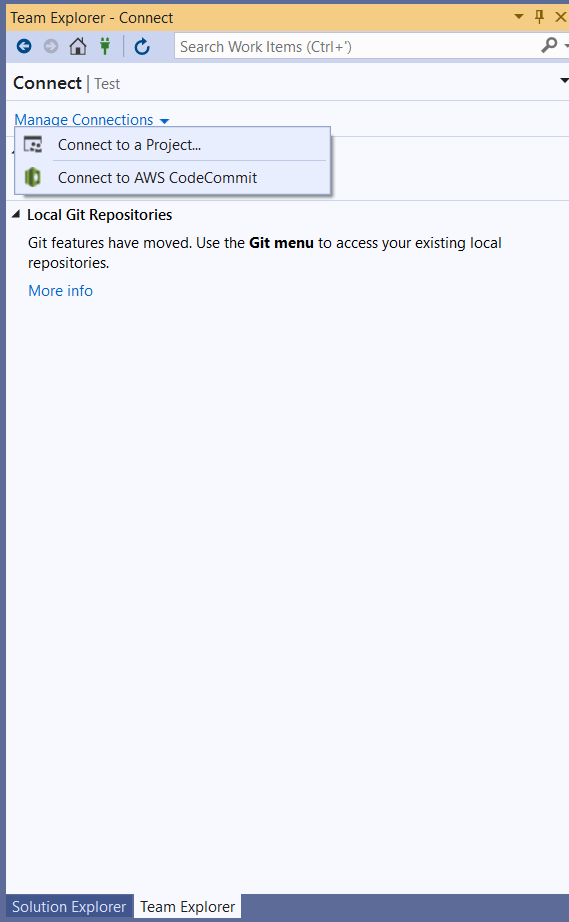

1. Select the project SampleWebApp created in Module 1 and click Connect

    

1. In the Team Explorer - Home, under Project, click on Clone Repository > Clone

    


1.  Click File \> New \> Project...

    

1.  The project dialog window will popup. Select the "ASP<span></span>.NET Web
    Application(.NET Framework)" template.

    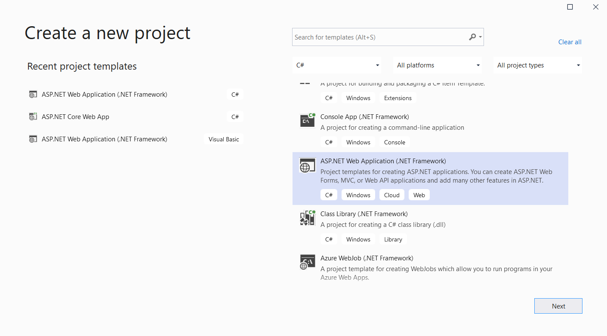

1. Enter the project name. Create the project in the same location where you cloned the repository

    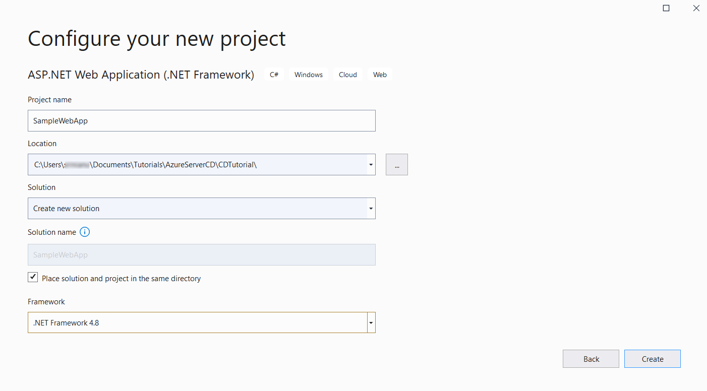

1.  Select MVC.
1. Click Create

    

### Module 3: Configure ASP<span></span>.NET application for AWS CodeDeploy 

#### Overview

Now that we have an ASP<span></span>.NET application, let's add the files needed to allow AWS CodeDeploy to understand the deployment and configuration.
There are two files we will need to add:

1.  **Appspec.yml** -- The application specification file is a YAML or
    JSON-formatted file used by AWS CodeDeploy to manage a deployment.
1.  **installapp.ps1** -- A script to deploy the Web package on the EC2 instance.

Implementation Instructions

1.  Create the appspec.yml file by right clicking on the project \>
    Add \> New Item...

    

1.  Name the file appspec.yaml and click Add.
   
    

1.  Copy the following code, paste into the file and save.

    ```yaml
    version: 0.0
    os: windows

    hooks:
      AfterInstall:
        - location: .\installapp.ps1

    ```

> Note: If you are saving this in Visual Studio on a windows machine you will need to do a "Save As..." and change the file encoding to the following:

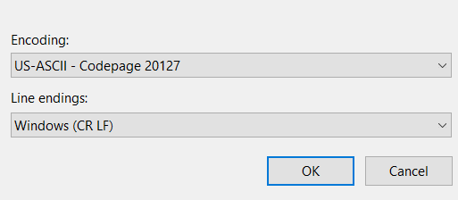

1.  Use the same process to create the installapp.ps1

1.  Copy the following code, paste into the installapp.ps1 file and
    save.

    ```
    & "$PSScriptRoot\SampleWebApp.deploy.cmd" /Y
    ```

### Module 4: Check-in to Azure DevOps source control

#### Overview

Now that we have the code we want deployed to EC2, we need to check it
into a source control system. In this module we will add our code to
Azure DevOps Repos through the Git window in Visual Studio.

#### Implementation Instructions

1.  With the ASP<span></span>.NET Core project open,  select Git from the menu bar, select Commit or Stash...

    

1. Enter a commit message and select Commit All and Push

    

1.  You will see a message once the push is complete.
   
    

### Module 5: Set up a Service role for EC2 instance

#### Overview

In this step we will create a service role which will give EC2 instances the required access to Amazon s3

#### Implementation Instructions

1.  From the AWS Console search for IAM.
1.  Select Roles > Create Role

    

1.  Select AWS service under Select type of trusted entity.
1.  Select EC2 under Choose a use case.
1.  Click on Next: Permissions

    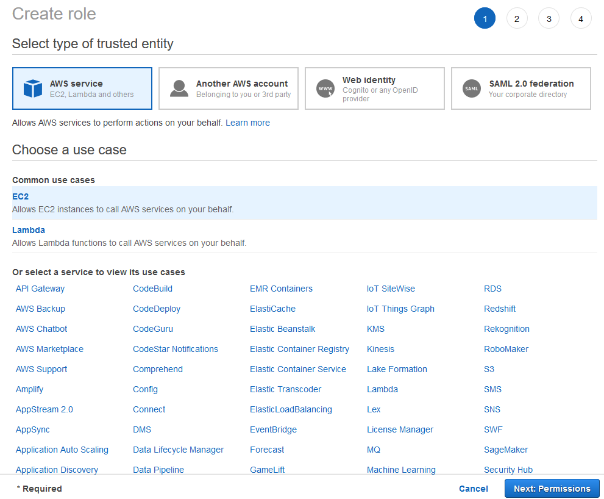

1. Select Create Policy.

    

1. Add the following permissions to the policy as follows

    

1.  Enter a policy Name - s3-policy
1.  Click on Create policy

    


1. In the Create role window, select the policy created above 
1. Click on Next: Tags

    

1. Enter the Role name and Click Create role

    


### Module 6: Create an EC2 instance

#### Overview

Now we will create an EC2 instance where our sample application code will be deployed.

#### Implementation Instructions

1.  From the AWS Console search for EC2.
1.  Click on Instances > Launch instances

    

1.  Select the Free tier eligible Microsoft Windows Server 2016 Base with Containers.

    

1.  Select Type - t2.micro
1.  Click on Next: Configure Instance Details.

    

1.  Select Network as default
1.  Select the IAM Service role created in Module 5 

    

1. Copy the following code, paste into the User data As text.

```

<powershell>
Read-S3Object -BucketName aws-codedeploy-us-west-2 -Key latest/codedeploy-agent.msi -File c:\temp\codedeploy-agent.msi
c:\temp\codedeploy-agent.msi /quiet /l c:\temp\host-agent-install-log.txt
Install-WindowsFeature -Name Web-Server,NET-Framework-45-ASPNET,NET-Framework-45-Core,NET-Framework-45-Features
Set-ExecutionPolicy Bypass -Scope Process -Force; iex ((New-Object System.Net.WebClient).DownloadString('https://chocolatey.org/install.ps1'))
choco install webdeploy -y
</powershell>

```

1. The above code downloads and installs the CodeDeploy agent, installs and configures IIS with ASP<span></span>.NET 4.6 on the EC2 instance.
1. Select Next: Add Storage


1. Select Next: Add Tags

    

1. Enter Key - Name, Value - CodeDeployInstance. This tag will be used to identify the EC2 instance while configuring AWS CodeDeploy
1. Select Next: Configure Security Group

    

1. Select an existing security group and select the default option
1. Select Review and Launch

    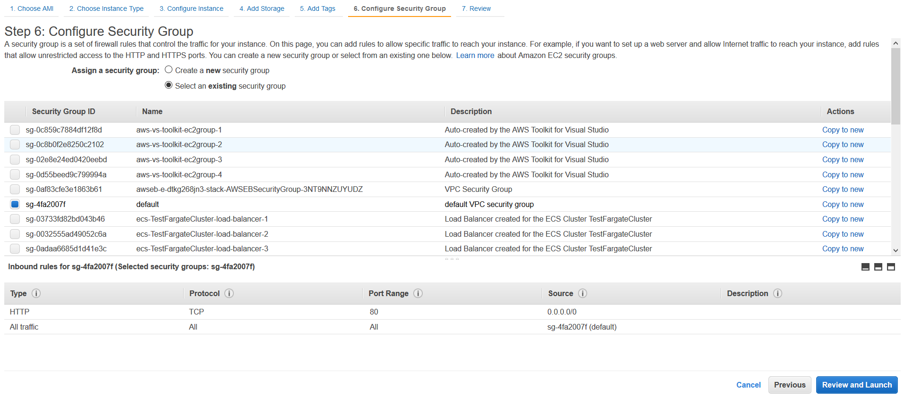

1. Select Launch

    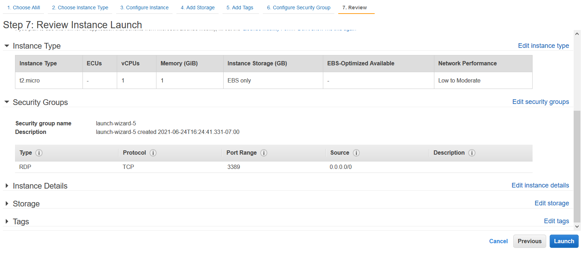

1.  Select Create a new key pair 
1.  Enter a Key pair name
1.  Select Download Key Pair
1.  Click Launch Instance

    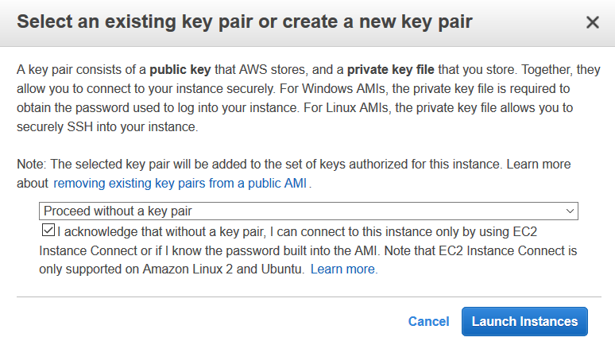

1. You can view the status of the EC2 instance by clicking on View Instances

    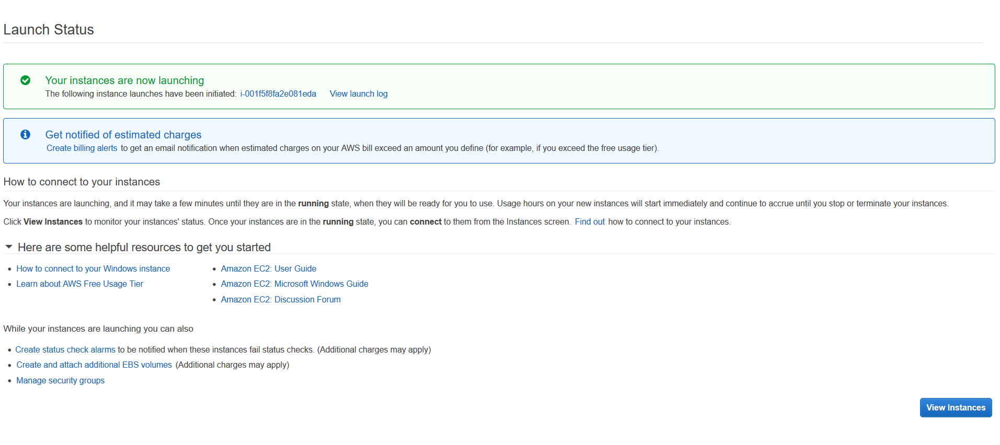

### Module 7: Set up a Service role for AWS CodeDeploy

#### Overview

In this step we will create a Service Role which will grant AWS CodeDeploy access to the target EC2 instance.

#### Implementation Instructions

1.  From the AWS Console search for IAM.
1.  Select Roles > Create Role

    

1.  Select AWS service under Select type of trusted entity.
1.  Select CodeDeploy under Choose a use case

    

1.  Select Next: Permissions

    

1.  A policy has already been attached. Select Next:Tags.

    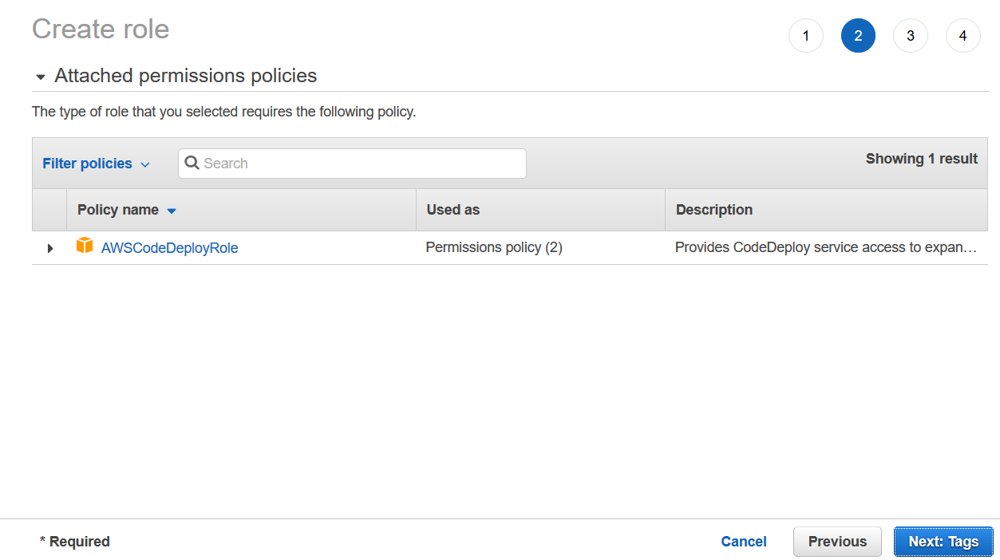

1.  Select Next: Review 

    

1.  Enter Role name and select Create role

    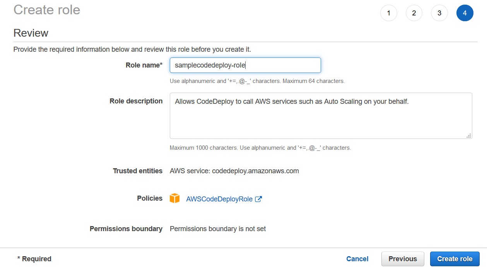


### Module 8: Setup AWS CodeDeploy

#### Overview

In this step we will create an application and a
deployment group in CodeDeploy.

#### Implementation Instructions

1.  From the AWS Console, search for CodeDeploy.

    

1.  Go to Applications, click Create application

    

1.  Enter the Application name
1.  Select EC2/On-premises under Compute platform and select Create application

    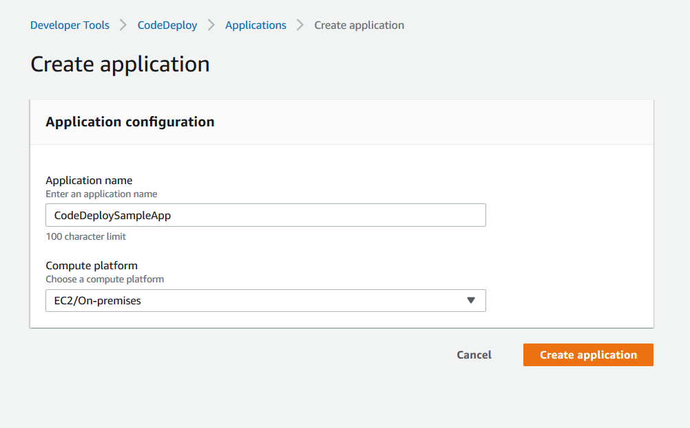

1.  Go to the application and select Create deployment group

    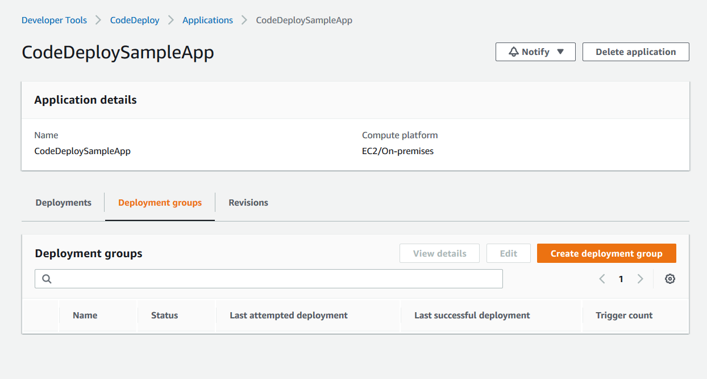

1.  Enter the Deployment group name
1.  Select the Service Role created in Module 7

    

1.  Choose In-place deployment.
1.  Select Amazon EC2 instances under Environment configuration
1.  Add a tag with Key - Name, Value - (Name of the EC2 instance created in Module 6) This will identify the EC2 instance created in Module 6

    

1.  Select Never under Agent configuration with AWS Systems Manager as we have already configured the EC2 instance with the CodeDeploy Agent.
1.  Select CodeDeployDefault.AllAtOnce under Deployment Settings.
1.  Deselect Enable load balancing.
1.  Select Create deployment group

    

1.  CodeDeploy is ready to receive our application.

### Module 9: Create an Amazon S3 bucket

#### Overview

In this module, we will create an Amazon S3 bucket to which the revision bundle will be uploaded. A revision in AWS CodeDeploy is a version of an application you want to deploy. Our sample application revisions are stored in Amazon S3

#### Implementation

1. From the AWS Console search for S3.
1. Select Create bucket.

    

1. Enter the Bucket name and select the AWS Region

    

1. Leave the remaining settings to default and click Create bucket

    

### Module 10: Integrate Azure DevOps and AWS CodeDeploy

#### Overview

In this step we will create an Azure DevOps build job that will deploy our
application to EC2 instances via CodeDeploy.

#### Implementation Instructions

1.  Open our project in Azure DevOps, click on Pipelines. Click Create Pipeline.

    

1.  Select Other Git.

    

1.  Choose the Azure Repos Git, select your project and Repository
1.  Select Continue

    

1.  Choose the ASP<span></span>.NET template and click Apply.

    


1. Go to the task Build solution and append the following in MSBuild Arguments. This will set the default path where our application will be hosted

    

1. Select the Tasks - Test Assemblies, Publish symbols path and Publish Artifact and select Remove selected task(s). We won't be needing these three tasks.

    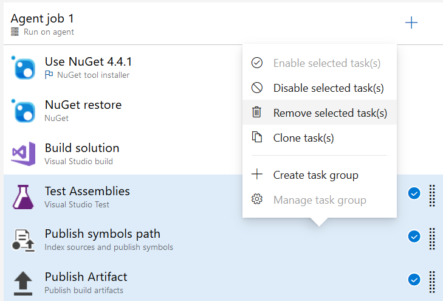

1.  Click the + symbol to add a new task.

    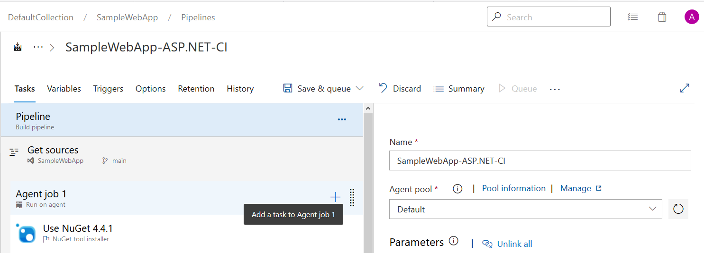

1.  Search for the Copy files task and click Add. The task will go to
    the bottom of the list on the left.

    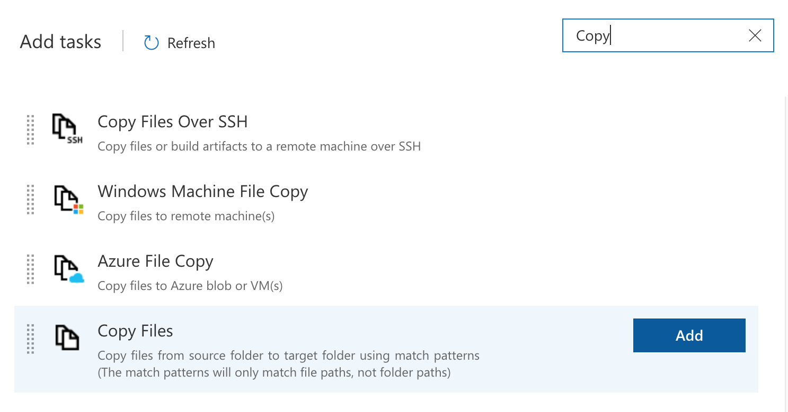

1.  Select the Copy files task and update the parameters as shown in the image.

    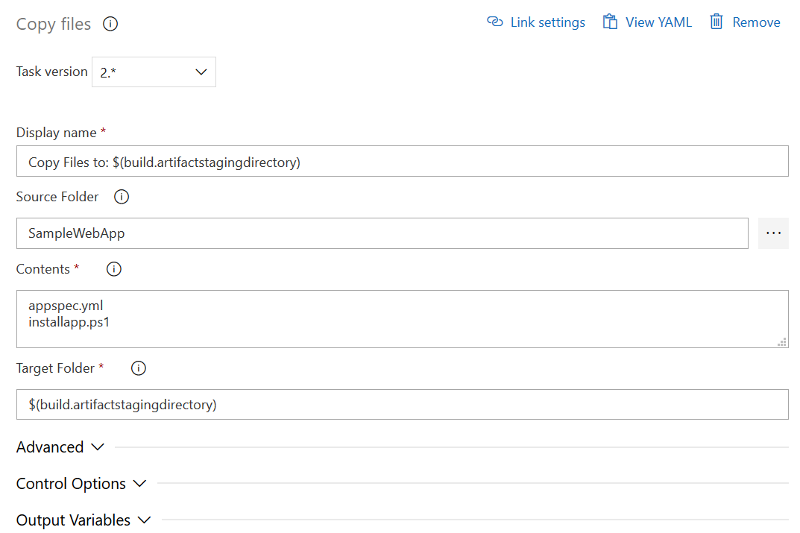

1.  Click the + symbol to add a new task. Search for the CodeDeploy task
    and click Add. The Task will go to the bottom of the list on the
    left. Update the parameters.

    

    > Note: Your first time you will need to install the AWS VSTS toolkit from
the Marketplace.

1.  Configure the Code Deploy task.

    


1.  Click Triggers and enable Continuous integration.

    

1.  Save the build.

### Module 11: Test the Deployment

#### Overview

In this module, we will deploy the code to the EC2 instances.

#### Implementation

1.  Make a change to your code and check it into Azure DevOps which initiates a
    build. Once the build is complete you will be able to click through
    the various steps in the process.

    

1.  You can view your deployed application by getting the public DNS or
    IP address for the EC2 instance and appending the default path added in Step 6 of Module 10 and navigate to the site in a browser.

    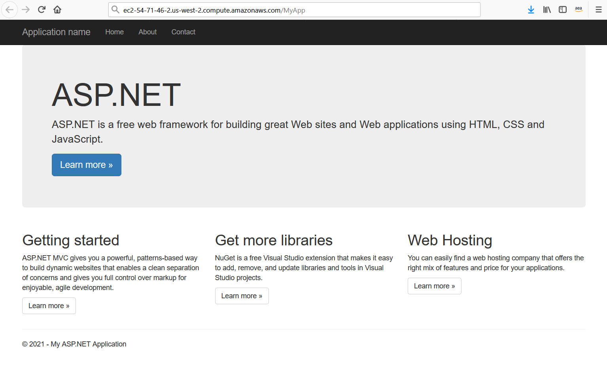

2.  You now have a working CI/CD pipeline that deploys an ASP<span></span>.NET
    application from source control to EC2.


