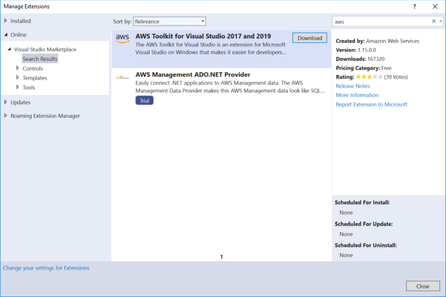
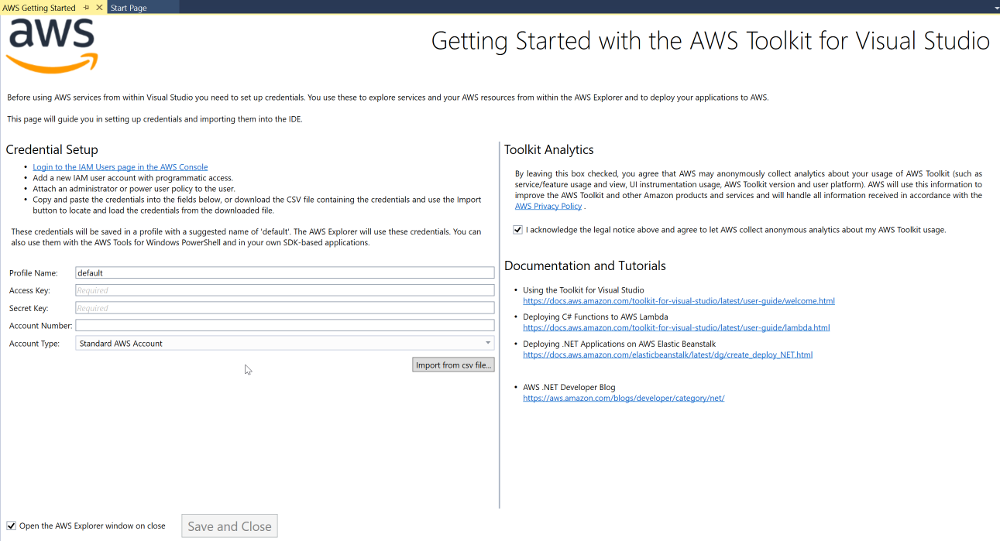
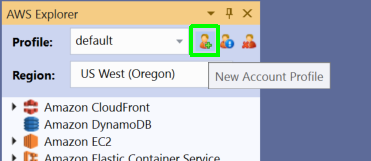
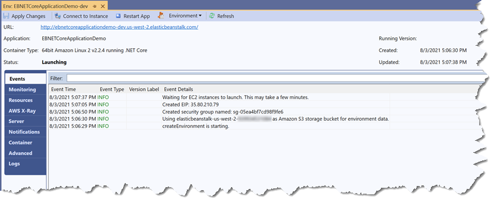
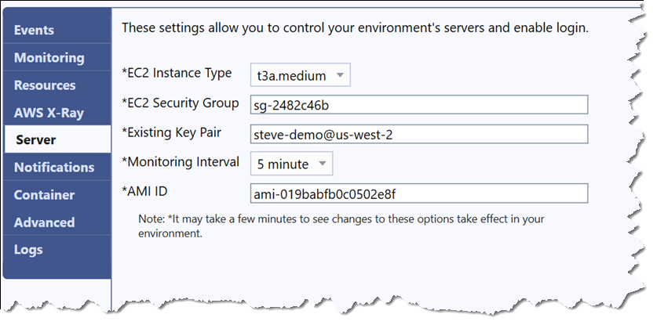
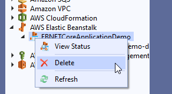
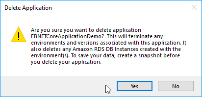

# Deploying ASP.NET Core Applications to AWS Elastic Beanstalk from Visual Studio

## Overview

[AWS Elastic Beanstalk](https://aws.amazon.com/elasticbeanstalk/) is a service that simplifies the process of provisioning AWS resources for your application. Elastic Beanstalk provisions the AWS infrastructure required to host your application. This infrastructure includes Amazon EC2 instances that host the executables and content for your application. Your deployed application infrastructure can also include:

* An Auto Scaling group to maintain the appropriate number of Amazon EC2 instances to support your application.
* An Elastic Load Balancing load balancer that routes incoming traffic to the Amazon EC2 instance with the most bandwidth.

The [AWS Toolkit for Visual Studio](https://aws.amazon.com/visualstudio/) provides a set of wizards and other tooling to simplify publishing your .NET or .NET Core applications and serverless functions to AWS.

In this guide we will use the toolkit's *Publish to Elastic Beanstalk* wizard to deploy a simple ASP.NET Core sample application to Elastic Beanstalk. The wizard enables you to deploy your application to a single instance environment or to a fully load balanced, automatically scaled environment from within the IDE with just a few simple steps. If your application uses SQL Server in [Amazon RDS](https://aws.amazon.com/rds/), the publishing wizard can also set up the connectivity between your application environment in Elastic Beanstalk and the database instance in Amazon RDS.

The sample application used in this guide is created from the ASP.NET Core Web API sample template in Visual Studio. The same steps can be followed to also deploy projects created from the ASP.NET, or ASP.NET Core, Web Application templates to Elastic Beanstalk.

* Links to documentation
  * [AWS Elastic Beanstalk Developer Guide](https://docs.aws.amazon.com/elasticbeanstalk/latest/dg/)
  * [AWS Toolkit for Visual Studio User Guide](https://docs.aws.amazon.com/toolkit-for-visual-studio/latest/user-guide/)

### Prerequisites

To complete the steps in this guide you will need:

✓ .NET Core 2.0 or higher installed\
✓ An AWS Account\*\
✓ An IAM user with access key credentials\*\*\
✓ Visual Studio 2017 or Visual Studio 2019 for Windows

\*Accounts that have been created within the last 24 hours might not yet have access to the resources required for this learning. If you don't have an account visit <https://aws.amazon.com> and click **Sign Up**.

\*\* You must have a set of valid AWS credentials, consisting of an access key and a secret key, which are used to sign programmatic requests to AWS. You can obtain a set of account credentials when you create your account, although we recommend you do not use these credentials and instead [create an IAM user](http://docs.aws.amazon.com/IAM/latest/UserGuide/Using_SettingUpUser.html) and use those credentials.

## Introduction

In this guide you are going to use the publishing wizard provided with the AWS Toolkit for Visual Studio to deploy an ASP.NET Core application from within the IDE to AWS Elastic Beanstalk. The guide contains the following modules:

1. Installing the AWS Toolkit for Visual Studio
1. Configuring the toolkit with credentials for your AWS account
1. Creating a sample ASP.NET Core application starter project
1. Publishing the sample application using the toolkit's "Publish to Elastic Beanstalk" wizard
1. Testing the deployed application
1. Deleting the deployed application

## Module 1: Installing the AWS Toolkit for Visual Studio

The AWS Toolkit for Visual Studio is distributed on the [Visual Studio Marketplace](https://marketplace.visualstudio.com/items?itemName=AmazonWebServices.AWSToolkitforVisualStudio2017) and can be download and installed from there, or installed from within Visual Studio. To install from within Visual Studio, follow these steps:

1. Start Visual Studio 2017 or Visual Studio 2019 and open the Extensions Management dialog:
    1. If you are using Visual Studio 2017 select the *Tools > Extensions and Updates* menu item.
    1. If you are using Visual Studio 2019 select the *Extensions > Manage Extensions* menu item.
1. Select *Online* in the left-hand pane and then enter **AWS** into the search field on the right.
1. Select the *AWS Toolkit for Visual Studio 2017 and 2019* entry that is displayed.

    

1. Click **Download** to schedule the package for installation.
1. Close the dialog and then close Visual Studio. The Visual Studio installer will then run -  click **Modify** to install the package.

    

> Note: When installing from within Visual Studio the toolkit is installed for that version of Visual Studio only. For example, if the above instructions are followed for Visual Studio 2017, even if you also have Visual Studio 2019 installed, the toolkit will only be present in Visual Studio 2017 after installation. To install in both 2017 and 2019 versions, download the toolkit's distribution file from the marketplace and double-click the resulting *AWSToolkitPackage.vsix* file to start the Visual Studio installer which will then offer to install the toolkit to both versions of Visual Studio.

When the installer completes click **Close** and then start Visual Studio. You can verify that the toolkit is installed by checking that an *AWS Explorer* entry can be seen in Visual Studio's *View* menu.

In the next module we will configure the toolkit with credentials so that it can access resources associated with your account. If you have already used the [AWS Tools for PowerShell](https://aws.amazon.com/powershell/) or the [AWS CLI](https://aws.amazon.com/cli/) then you may have *credential profiles* already set up containing credentials that the toolkit can use; in this case you can skip module 2.

## Module 2: Configuring the Toolkit with AWS Credentials

Before you can use the toolkit you need to provide programmatic AWS credentials which consist of an access key and a secret key. These credentials allow you to access your AWS resources from within the IDE using the toolkit. The toolkit refers to these credentials as a *credential profile*. A single profile stores an access and secret key pair.

The toolkit supports switching between multiple credential profiles, from any number of accounts. When you add a profile to the toolkit the credentials are encrypted and stored in a file local to your current logged-on user account. This file cannot be used by another user account on the same machine, or on a different machine. The encrypted credential file can also be used by the [AWS SDK for .NET](https://docs.aws.amazon.com/sdk-for-net/) and the [AWS Tools for PowerShell](https://aws.amazon.com/cli/).

The toolkit can also load credential profiles defined in the shared credential file used by the [AWS CLI](https://aws.amazon.com/cli/) and other AWS SDKs. This file, which is plain text and not encrypted, is normally stored in a file named *credentials* in a subfolder named *.aws* beneath your user account folder.

>Note: The toolkit only reads credential profiles from the shared credential file. New profiles created using the toolkit are always stored in the encrypted store file.

### Step 1: Creating an IAM user

Although you can use the access and secret key credentials from your root root account to the toolkit we strongly recommend creating and using an IAM user, as detailed in the steps below.

> Note: If you already have a user account you wish to use with the toolkit, and have the credentials to hand, you can skip to step 2.

1. Login to the AWS Management Console and navigate to the [AWS IAM home page](https://console.aws.amazon.com/iam/home)

1. Click **Users** on the left navigation pane, then click **Add User**

1. Provide a user name and select **Programmatic Access** as the Access Type. Click **Next:Permissions**.

1. On the **Set Permission** dashboard, click **Attach existing policies directly** and then choose the permissions for the user:
    > Note: Although you could scope this user to be able to use only AWS Elastic Beanstalk the toolkit, which has features for multiple services, works best if you attach an administrator or power user policy.
    1. To scope the user to be able to use AWS Elastic Beanstalk only, find and select the policy named **AWSElasticBeanstalkFullAccess**.
    1. To setup the user with *Power User* access, find and select the policy named **PowerUserAccess**.
    1. To setup the user with *Administrator* acccess, find and select the policy named **AdministratorAccess**.

1. When you have selected the policy you require, click **Next:Review** to continue.

1. On the review page, verify your selections and click **Create User**.

1. Once the user has been created, click "**Download .csv**" button to download the generated credentials in a csv-format text file.\
    > **Note:** This is the **only** time you will be able to view the generated secret key for the user. Be sure to copy the keys or download the file to prepare for adding the credentials to the toolkit in the next step.

### Step 2: Adding the user credentials to the toolkit

When the toolkit is run for the first time after installation it checks to see if any profiles can be found on the local system. If none are found, a Getting Started page is displayed (Visual Studio 2017 only) enabling you to configure your first profile:

You can paste the generated access and secret key for your IAM user account into the relevant fields, and give the credential profile a name that you will use to refer to the credentials when using the toolkit. You can also import credentials from the csv-format file that you downloaded when creating a new IAM user.

If you are using Visual Studio 2019 the Getting Started page is not currently displayed if no credential profiles are found so you must use the AWS Explorer window to add your credentials. In Visual Studio 2017 or 2019 the AWS Explorer window can also be used to add additional credential profiles at any time, update profiles to have new keys, or delete profiles.

To add a credential profile using the AWS Explorer window:

1. First open the AWS Explorer window by selecting the *View > AWS Explorer* menu item, then click the **Add profile** button next to the *Profile:* field:

    

1. In the **New Account Profile** dialog box, fill out the following fields:

    * Profile Name
    * Access Key ID
    * Secret Access Key

    

1. Alternatively, provide a Profile Name and then click **Import from CSV file** and choose the CSV file you downloaded in previous step.
1. When you have entered or imported your credentials click **OK** to save the new credential profile. The dialog will close the the AWS Explorer will make the new credential profile active.

## Module 3: Creating a Sample .NET Core Application Starter Project

In this module, you will be creating the sample ASP.NET Core Web API application that will be deployed to Elastic Beanstalk. You can also elect to deploy an ASP.NET Web Application, or ASP.NET Core Web Application, if you wish instead of a web api.

1. In Visual Studio select *File > New > Project* from the menu.

1. From the project templates in the **New Project** dialog box locate and select the **ASP.NET Core Web Application** template.

1. Give the new project a name - *EBNETCoreApplicationDemo* and complete the rest of the new project wizard.

    1. In the *Location* field enter the path to a folder on your development machine to contain the generated solution and project files and click **OK**.
    1. In the *New ASP.NET Core Web Application* dialog box, choose **Web API**. For the purposes of this guide the *Enable Docker Support* checkbox can be left unchecked.
    1. Click **OK** to allow Visual Studio to create the solution and project.

We are not going to make any changes to the generated project in this guide and can now proceed to deployment.

## Module 4: Publishing the sample application with the *Publish to Elastic Beanstalk* Wizard

In this module you will use the Elastic Beanstalk publishing wizard from the toolkit to deploy the sample application.

1. In the Solution Explorer window right-click on the project to open a context menu. Click the *Publish to AWS Elastic
    Beanstalk* option to start the deployment wizard.

1. In the *Profile* section select the AWS credential profile you created earlier in the **Account profile to use** drop-down
    list.

1. Using the *Region* drop-down list, choose the region to which you want Elastic Beanstalk to deploy the application.

1. In the *Deployment Target* section choose *Create a new application environment* to perform the first deployment of your application, then click *Next* to move to the next page of the wizard.

1. On the *Application Environment* page, in the *Application* section's *Name* field, the wizard will propose a default name for your Elastic Beanstalk application based on the name of the project. You may change this value if so desired (max 100 characters).

1. In the *Environment* section, use the *Name* drop-down list to select the name for the first environment in for your application, **EBNETCoreApplicationDemo-dev**. Note that if you changed the name of the application in the step above the available selections for environment name will change to reflect the application name. You are also free to enter a name of your own choosing provided it conforms to Elastic Beanstalk's naming rules which are:

    * must be from 4 to 40 characters in length,
    * the name can contain only letters, numbers, and hyphens,
    * it can't start or end with a hyphen,
    * this name must be unique within the region you selected on the first page of the wizard.

1. Using the selected environment name the wizard will propose a URL for the deployed application in the *URL* field. You can accept this or enter your own. Click the **Check Availability** button to make sure the URL for your web application is not already in use, then click **Next**.

1. On the *AWS Options* page, under *Amazon EC2 Launch Configuration*, the wizard will pre-set the *Container type* drop-down list to be the latest available but you can change this if you require. For this guide, stay with with the selected default (64bit Windows Server 2016 v2.0.2 running IIS 10.0 at time of writing).

1. In the *Instance type* drop-down list, specify **t2.micro** as the Amazon EC2 instance type to use. This will minimize the cost associated with running the instance.

1. In the **Key pair** drop-down list, if you have one choose an existing Amazon EC2 instance key pair to use to sign in to the instances using remote desktop (RDP) that will be used to host your application (if needed).
    > Note: If you don't have a key pair already you can elect to have the wizard create one or to not use one (this guide will not require you to sign in to the instance(s).

    In this page of the wizard you will also see additional optional configuration options as follows, all of which can be left at their defaults:

    * **Use non-default VPC**

    This option will allow you to deploy application environment in a Virtual Private Cloud (VPC). The VPC must have already been created including at least one public and one private subnet. An Elastic Load Balancer for your application will be deployed to the public subnet which is associated with a routing table that has an entry that points to an internet gateway. Instances created for your application will be placed in the private subnet.

    * **Single Instance environment**

    This option allows you to launch only a single Amazon EC2 instance rather than a fully load balanced, automatically scaled environment.

    * **Enable rolling deployments**

    AWS Elastic Beanstalk provides several options for how deployments are processed. With rolling deployments, Elastic Beanstalk splits the environment's EC2 instances into batches and deploys the new version of the application to one batch at a time, leaving the rest of the instances in the environment running the old version of the application. During a rolling deployment, some instances serve requests with the old version of the application, while instances in completed batches serve other requests with the new version.

    For this guide, leave all the above options at their defaults (unchecked) and click **Next** to proceed.

1. On the *Permissions* page, accept the default values **aws-elasticbeanstalk-ec2-role** and **aws-elasticbeanstalk-service-role**. The *Deployed Application Permissions* will be used to deliver AWS credentials to your application so that it can access other AWS services and resources. *Service Permissions* will allow Elastic Beanstalk service to monitor the environment on your behalf.

    Click **Next** to proceed.

1. On the *Application Options* page, in the *Build and IIS
    Deployment Settings* section, specify the target build configuration as **Release|AnyCPU**. In the *Framework* drop-down list, accept the suggested default unless you need to change it. In the *App Path* field accept the default path (**Default Web Site/**) that IIS will use to host the application.

    > Note: Because we elected to deploy a single instance environment above, Elastic Beanstalk will use the instance health to determine if your application is responsive. If you had elected to deploy a multiple instance, load balanced, application you could enter a custom health check URL path here (for example **/api/values** for our sample). Elastic Beanstalk would then use this URL to determine if your web application is still responsive.

1. The toolkit will also provide a default deployment version label which is based on the current date and time which you can accept or change.

    

1. Click **Finish** to move to the wizard's *Review* page and look over your selections. When ready click **Deploy** to start the build and deployment process which will close the wizard.

The toolkit will now build the deployment package for the application and upload it to Amazon S3, before requesting Elastic Beanstalk begin construction of a new application and environment. As it does this it opens a view bound to the new environment and you can see various events get displayed as the environment resources are created. The deployment may take a few minutes. When it completes the *Status* field will change from **Launching** to **Environment is healthy**.

## Module 5: Testing the Deployed Application

When the deployment has completed and the environment status has changed to **Environment is healthy** you can access the deployed application.

Elastic Beanstalk created multiple resources to host your sample .NET core application. You can use the navigation tabs on the left of the environment view to discover what was created, such as:

* EC2 Instance(s)
* Load Balancer
* Auto Scaling Group

Various settings for those resources can also be configured from within the toolkit's environment view without needing to log into the AWS Management Console:

To access the deployed application, click the URL shown at the top of the environment view page. If we had deployed a web application (with a UI) the application would now launch into a browser. In this guide we deployed a web api so to access it modify the URL in your browser to append **/api/values** to the URL. You should then see the following data returned from the sample API:

## Module 5: Deleting the Deployed Application

If you leave the resources created in this guide running, you will incur costs so you may want to delete the Elastic Beanstalk application which will terminate all running resources. You can do this from within the toolkit as follows:

1. Open the AWS Explorer window from the *View > AWS Explorer* menu item.
1. Ensure the *Profile* and *Region* fields match the credentials you used to deploy the application and the region to which it was deployed.
1. Expand the Elastic Beanstalk node in the explorer to see your deployed application.
1. Right-click on the application name and from the context menu select **Delete**

    

1. The toolkit will prompt for confirmation. Click **Yes** to proceed and terminate all resources running in the environment, together with the Elastic Beanstalk application.

    

Congratulations! You have now completed this guide and deployed your first ASP.NET Core application to AWS Elastic Beanstalk.
