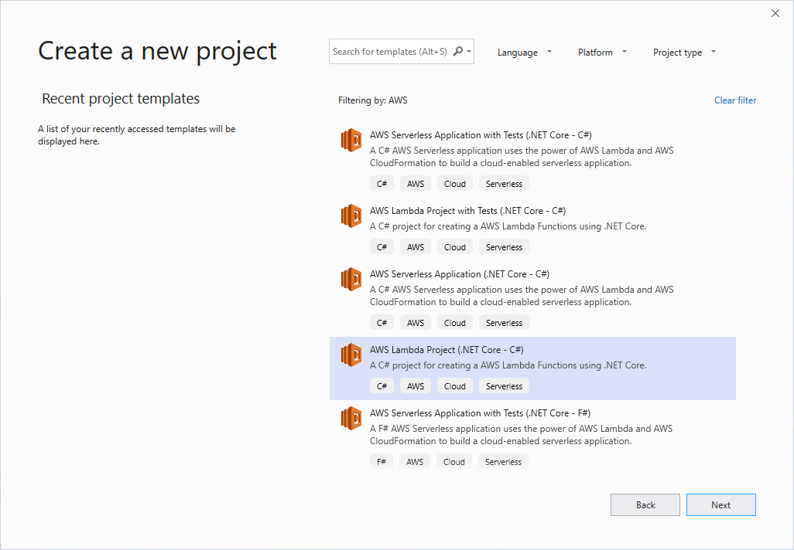
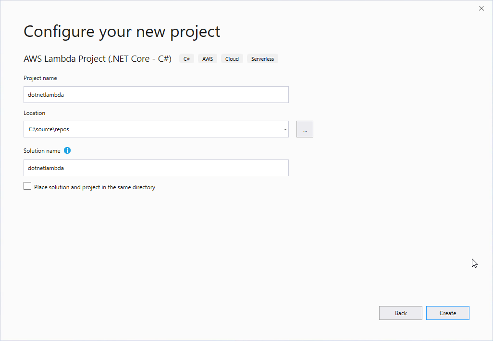
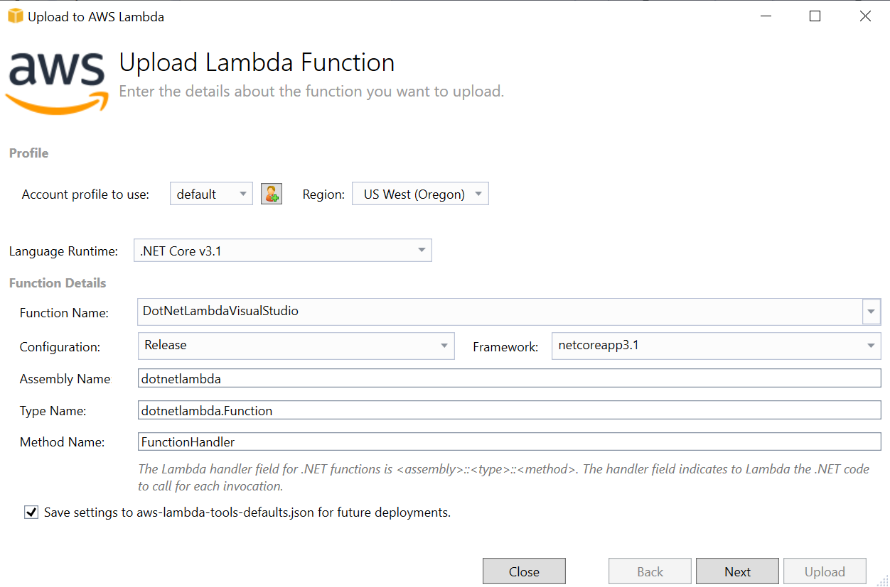
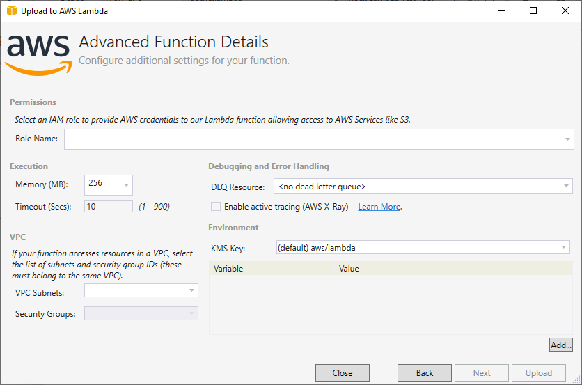
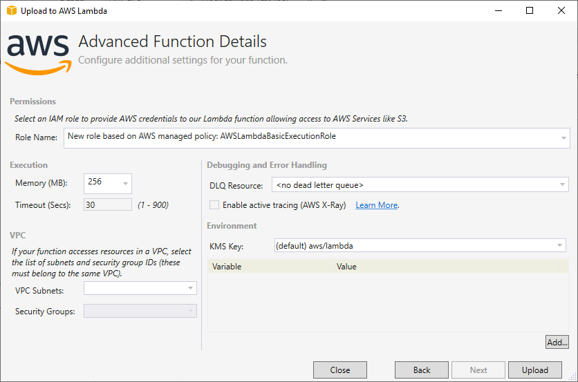
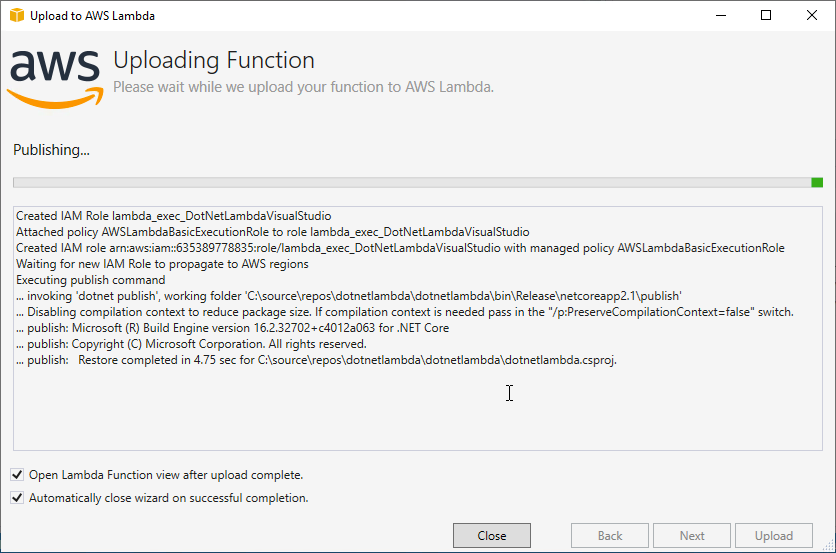
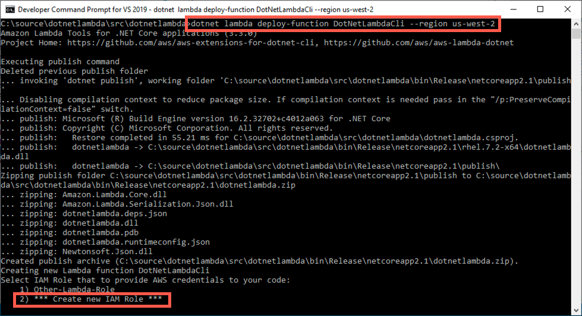
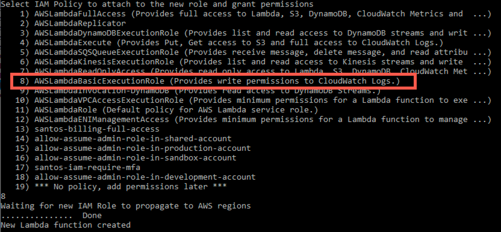
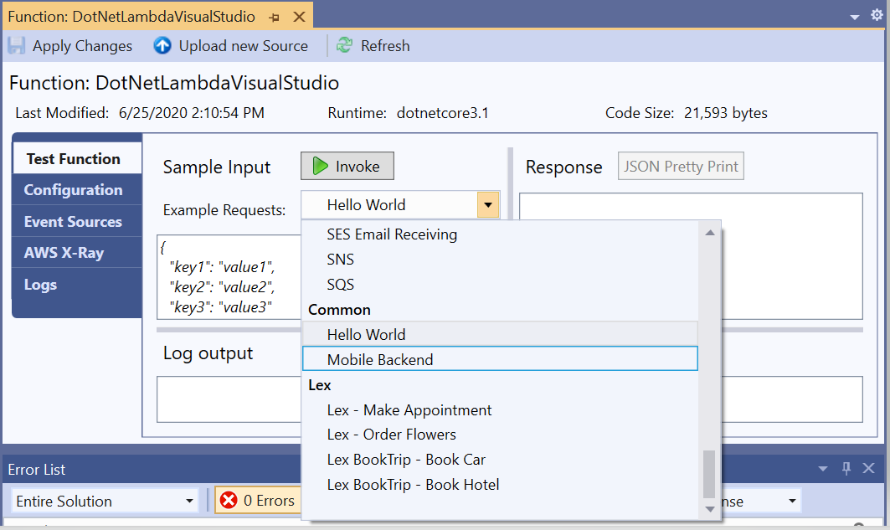
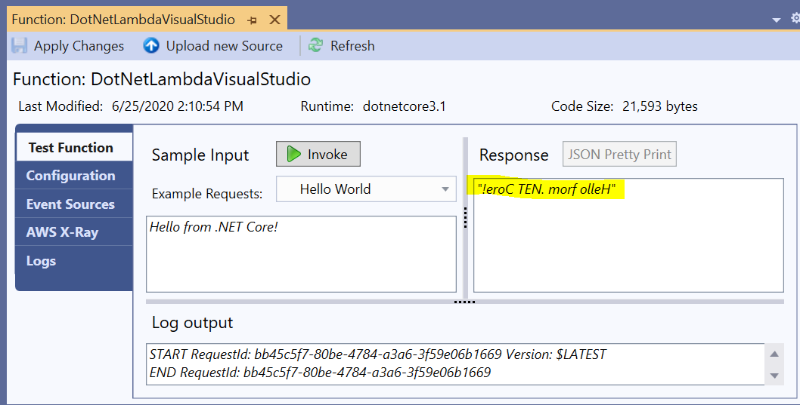

# **Building .NET Lambda Functions with Visual Studio and dotnet CLI**

## Overview

[AWS Lambda](https://aws.amazon.com/lambda/) provides a serverless compute service that abstracts away the underlying computing infrastructure and resources, allowing you to run code in response to events from a variety of sources, including HTTP requests, data changes, and file updates. The uses of Lambda functions are far and wide, although they’re frequently used to extend other AWS services with custom logic, or to create full backend services. 

You can create Lambda functions in a number of runtimes - including .NET Core 2.1, the Long Term Support (LTS) version of .NET Core. Additionally, you can use the [Amazon.Lambda.RuntimeSupport](https://github.com/aws/aws-lambda-dotnet/blob/master/Libraries/src/Amazon.Lambda.RuntimeSupport) library to easily create Lambda functions using .NET standard compatible runtimes. This is enabled by a Lambda feature called [custom runtimes](https://docs.aws.amazon.com/lambda/latest/dg/runtimes-custom.html). When developing in .NET Core you should generally choose .NET Core 2.1 for any new Lambda functions you are creating, but there are some cases when it might be useful to leverage a custom runtime.

This walk-through serves as an introduction to developing Lambda functions using .NET Core, and demonstrates creating, deploying, and testing a basic Lambda function that takes a single string and returns a reversed copy of the string. 

Step-by-step instructions are provided for using Visual Studio 2019 and the [AWS Toolkit for Visual Studio](https://aws.amazon.com/visualstudio/) on Windows, or alternatively using the .NET Core CLI on Windows, Mac OS X, or Linux.

### Modules

* Setup Environment
* Create a Basic Lambda Function

### Prerequisites

* AWS Experience - Beginner (Level 200 Content)
* Time to Complete - 25 mins
* Cost to Complete - Each service used in this architecture is eligible for the AWS Free Tier. If you are outside the usage limits of the Free Tier, completing this learning path will cost you less than $0.25*.
* Tutorial Prereqs - To complete this learning path, you will need:
  * An AWS Account**
  * An IAM user with access key credentials***
  * (Optionally) Visual Studio 2019 for Windows

\* This estimate assumes you follow the recommended configurations throughout the tutorial and terminate all resources within 24 hours.

\*\* Accounts that have been created within the last 24 hours might not yet have access to the resources required for this learning. If you don’t have an account visit https://aws.amazon.com and click Sign Up.

\*\*\* You must have a set of valid AWS credentials, consisting of an access key and a secret key, which are used to sign programmatic requests to AWS. You can obtain a set of account credentials when you create your account, although we recommend you do not use these credentials and instead [create an IAM user](http://docs.aws.amazon.com/IAM/latest/UserGuide/Using_SettingUpUser.html) and use those credentials.

## Module 1: Setup Environment

In this module, you'll configure your development environment for working with AWS Lambda functions. These instructions provide 2 different options to choose from for your development environment, Visual Studio 2019 for Windows, or the .NET Core CLI for Windows, Mac, or Linux, using an editor of your choice.

### Things to Note
* Time to Complete - 10 mins

### Implementation Instructions

#### Step 1: Setup Visual Studio 2019 for Windows
If your development environment is Visual Studio 2019 on Windows, you will need to ensure the following components are installed:

1.	The .NET Core SDK 2.1 for Windows: https://dotnet.microsoft.com/download/dotnet-core
1.	Visual Studio 2019
1.	The AWS Toolkit for Visual Studio: https://aws.amazon.com/visualstudio/ 

#### Step 1: Setup .NET Core CLI on Windows, Mac, or Linux

If you are using .NET Core CLI on Windows, Mac, or Linux, you will need to install a few components, as follows:

1.	The .NET Core SDK 2.1 for Windows, Mac, or Linux: https://dotnet.microsoft.com/download/dotnet-core
1.	Install the AWS Lambda templates with the AWS Lambda NuGet package by running the following in a terminal window.
    ```shell
    dotnet new -i Amazon.Lambda.Templates::*
    ``` 
1.	Verify the new AWS Lambda templates have been installed by running the following in a terminal window.
    ```shell
	dotnet new lambda.EmptyFunction -l
	```
	If the command returns details of a single Lambda Empty Function template then the templates have been installed correctly.
1. Install the [.NET Core Global Tools for AWS](https://aws.amazon.com/blogs/developer/net-core-global-tools-for-aws/). To install Amazon.Lambda.Tools use the dotnet tool install command.
   ```shell
   dotnet tool install -g Amazon.Lambda.Tools
   ```

You will also need a text editor or an IDE for modifying, such as vi, emacs, nano, [Visual Studio for Mac](https://www.microsoft.com/net/download/), or [Visual Studio Code](https://code.visualstudio.com/) for Windows, Mac, or Linux.

## Module 2: Create a Basic Lambda Function

In this module you'll create a project for your Lambda function, write the code for a basic Lambda function, and finally deploy and test the Lambda function. 
These instructions provide options for 2 different development environments: Visual Studio 2019 for Windows, or .NET Core CLI on Windows, Mac, or Linux.

### Things to Note
* Time to Complete - 15 mins

### Implementation Instructions

#### Step 1: Setup Visual Studio 2019 for Windows
If you are using Visual Studio 2019 on Windows as your development environment, you can create a solution as follows:

1. In Visual Studio, from the menu, select *File > New > Project* to launch the New Project dialog.
2. In the New Project dialog, click on *AWS Lambda* in the left menu and select the *AWS Lambda Project (.NET Core - C#)* project type.

    

3. Select a name for your project, and then click the **Create** button.

    

4. On the Select Blueprint dialog, select the *Empty Function* blueprint then click the **Finish** button.

    

#### Step 1: Create Project using .NET Core CLI

You can also build and deploy .NET Lambda functions to AWS from the command line, which works equally well on Windows, Mac OS X and Linux.

For this walk-through, we’ll make use of the same blueprint (template) that we used in the previous section in Visual Studio. 

Then, follow the steps below to create and deploy your Lambda function.
1. Open a command line or terminal window.
1. Create a folder to contain your new project. The folder name becomes the name of your .NET Core project, so choose something meaningful. For this walk-through, we are using *dotnetlambda* as the folder name.
1. Navigate to the folder created above and to create the new Lambda project enter the command 
    ```shell
	dotnet new lambda.EmptyFunction
	```
	This creates two subfolders-*src* and *test*-each of which has a .NET Core project folder inside. We won’t use the *test* project in this walk-through.

#### Step 2: Create Lambda Function in Visual Studio 2019 for Windows
1.	In the *Solution Explorer* pane, expand the project node for the app and double-click **Function.cs** to open it in an editing pane.
1.	Look through the *Function* class and locate the *FunctionHandler* method. This is the method that will be called when your Lambda function is invoked and contains the logic you want to execute.

    > Note: You can create other methods and classes to hold your logic and call them from FunctionHandler, as well as referencing other .NET Standard libraries. You can also change the name of the FunctionHandler method, as the name of the method is part of the Lambda configuration. For this walk-through, we’ll keep the default name.
1.	For this walk-through, change the return line inside of *FunctionHandler* from the default code—which calls `.ToUpper()` on the input string—to some code that reverses the string:
    ```csharp
	return new string(input?.Reverse().ToArray());
	```
1.	Save your changes.

This very simple example method will run synchronously. If you create a Lambda function that makes calls out to other APIs or services, or any operation that will run asynchronously, consider using the [async - await](https://docs.microsoft.com/en-us/dotnet/csharp/programming-guide/concepts/async/) pattern, and change the `FunctionHandler` signature to return `Task<return-type>`, for example, `Task<string>`.

#### Step 2: Lambda Function using .NET Core CLI
1.	Change directory into the *src* folder, and then into the project folder. For example:
    ```shell
	cd src/dotnetlambda
	```
1.	Use the editor of your choice to review the code in the file *Function.cs* and locate the *FunctionHandler* method. This is the method that will be called when your Lambda function is invoked and contains the logic that you want to execute.
    > Note: You can create other methods and classes to hold your logic and call them from *FunctionHandler*, as well as referencing other .NET Standard libraries. You can also change the name of the *FunctionHandler* method, as the name of the method is part of the Lambda configuration. For this walk-through, we’ll keep the default name.

1.	Using an editor of your choice, edit the *Function.cs* file. For this walk-through, change the return line inside of *FunctionHandler* from the default code—which calls `.ToUpper()` on the input string—to the following code that reverses the string:
    ```csharp
	return new string(input?.Reverse().ToArray());
	```
1.	Save your changes.
1.	Run the following command to add the AWS dotnet Lambda tools and other packages referenced in the project:
	```shell
	dotnet restore
	```
1.	To ensure you didn’t make any errors when editing your code, run the following command to build the project:
    ```shell
	dotnet build
	```
    Note – this can take a few moments. You should see the message, `Build Succeeded`.

This very simple example method will run synchronously. If you create a Lambda function that makes calls out to other APIs or services, or any operation that will run asynchronously, consider using the [async - await](https://docs.microsoft.com/en-us/dotnet/csharp/programming-guide/concepts/async/) pattern, and change the `FunctionHandler` signature to return `Task<return-type>`, for example, `Task<string>`.

#### Step 3: Deploy to AWS using Visual Studio 2019 for Windows
Now, we’ll use the Lambda publishing wizard in the AWS Toolkit for Visual Studio to publish the function to AWS Lambda, and then test it using the toolkit’s built-in testing functionality.

1.	Right-click the project node in the Visual Studio Solution Explorer pane, and select, Publish to AWS Lambda. This launches the publishing wizard.

1.	In the first step of the wizard, ensure the Region drop-down shows the region to which you want to publish and run the Lambda function. Type in a name for your function, and confirm that the Assembly Name, Type Name, and Method Name fields are properly filled in. If you didn’t change the name of the class or method, the Type Name should be <project name>.Function and the Method Name should be FunctionHandler (where <project name> is the name you chose for the project).

1. Click the **Next** button, which displays the Advanced Function Details step of the Lambda wizard. 

1.	In the Advanced Function Details, click the drop-down next to Role Name, scroll down to the entries under New Role based on AWS managed policy and select AWSLambdaBasicExecutionRole.
    > Note:	For any production app, you should create a role with the minimum permissions required for the Lambda function to operate.

    

1.	Leave the other settings to the default values. We won’t be running this Lambda in your VPC, so do not select anything for VPC Subnets. 

1. Click the **Upload** button to finish deploying your Lambda function.

### Step 3: Deploy to AWS using .NET Core CLI
Now we will use the AWS Lambda tools for .NET Core to deploy the Lambda function to AWS. The tools were automatically added when you ran `dotnet restore` in the previous step. 
1. Use the dotnet lambda deploy-function command to deploy your function. You can either enter it without any arguments, in which case you will be prompted for the name of the function and the region, or you can supply them as arguments like this:
    ```shell
    dotnet lambda deploy-function DotNetLambdaCli --region us-west-2
    ```
2. When prompted to assign a role from the numbered list of roles or to create a new role, type the number next to *** Create new IAM Role *** and press Enter.
    
1.	When prompted for a name for the new role, provide a name of *Lambda-basic-permissions-role* and press enter.
    
1.	When prompted to select an IAM policy to attach to the new role, type the number next to
AWSLambdaBasicExecutionRole (Provides write permissions to CloudWatch Logs.)
and press Enter.
    

It will take a few moments for the new role to propagate to all the AWS regions. After the new role is propagated out, you should see the message, New Lambda function created. 

#### Step 4: Test using Visual Studio 2019 for Windows

After the wizard is finished deploying your function, the View Function pane will open automatically in Visual Studio. If it doesn’t open automatically, you can open it by expanding the AWS Lambda node in the AWS Explorer  and double-clicking your function. Refresh the pane if it isn’t showing in the list.


Now, we’ll test our function with sample input from the View Function pane and view the result.
1.	In the View Function pane, ensure that Test Function is selected in the left menu bar.
1.	In the drop-down next to Example Requests, select **Hello World**. 
    
1. The input window will display a sample JSON payload. Delete the entire JSON blob, and type in some text, such as: **Hello from .NET Core!**
    
1.	Click the Invoke button to invoke your Lambda function with your text as the input.
1.	View the response in the Response area. You should see the following response text:
**!eroC TEN. morf olleH**
    

Congratulations, you have successfully created, deployed and tested a .NET Lambda function to AWS using the AWS Toolkit for Visual Studio!

#### Step 4: Test using .NET Core CLI

We can invoke our function from the command line and pass a string as input using the following command. If you deployed to a region other than us-west-2, ensure you specify it after the --region flag.
1. Type the below command all on one line.
    ```shell
    dotnet lambda invoke-function DotNetLambdaCli --region us-west-2 --payload "Hello from .NET Core!"
    ```    
1. After the function executes, you should see the output as:
    

    You will also see some logging information including the total duration, billed duration, and memory size.

Congratulations, you have successfully created, deployed and tested a .NET Lambda function to AWS using the AWS tools for the .NET CLI!