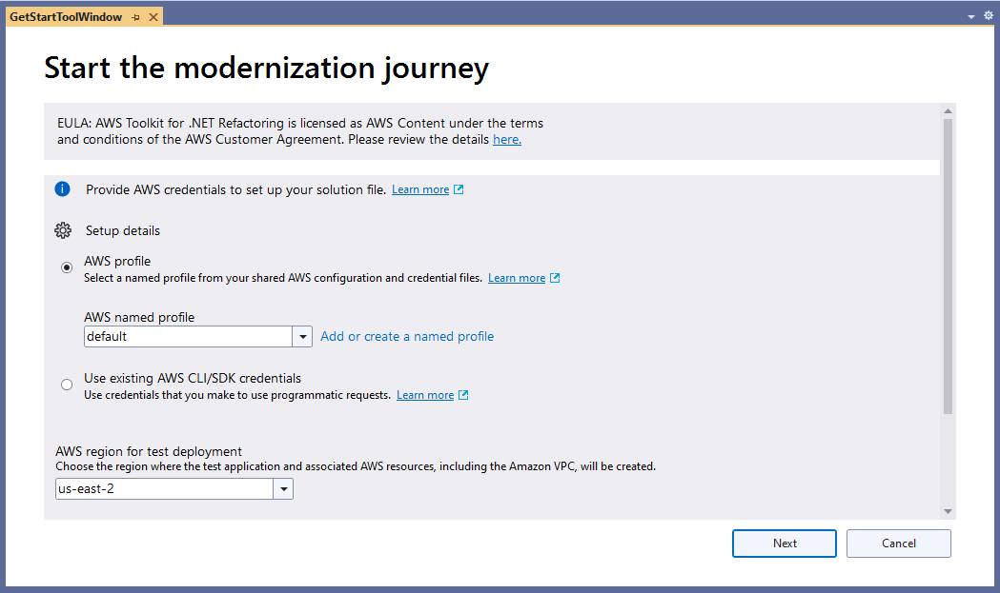

# Assessing your application

The first step in using the AWS Toolkit for .NET Refactoring to refactor your application from .NET Framewor 4.8 to .NET 6 is to perform
an assessment of the applciation. This assessment will scan through your application code, dependancies and NUGet packages to help determine
the level of complexity with converting your applciation. 

The assessment is non destructive, the results of the assesssment is a report.

From Visual Studio, open the solution file

```
C:\source\MediaLibrary4.8\MediaLibrary\MediaLibrary.sln
```

If the tooklit does not automatically open the Getting started page below, you can manually launch the Getting started page by clicking on the Extensions menu, select the AWS Toolkit for .NET Refactoring, and then clicking on Getting Started. 


## Configuring the Toolkit

The AWS Toolkit will need to be configured on the first execution. The configuration page is seen here:



In order tp progress beyond the first page, you must click on the link under the End User License Agreement (EULA.) Click on this link and read the agreement on the linked page.

The first configuration option is to select how the toolkit will connect to AWS. You have two options for these details. First you can specify a named profile that has been configured by the AWS Command Line. In this case you have an access key and a secret key configured on your machine. Typically these credentials are stored by using the command:
```
aws configure
```
And then providing credentials.

The second option is to allow the tool to locate credentials automatically. This option will allow the tool to use credentials that have been imported via IAM Identity Center (Formerly SSO) or inherit credentials from an IAM Role for example.

Functionality for the application will be identical with either method, as long as the selected method has valid credentials into your AWS account. If you are unsure of which option to use, consult with your AWS Account Administrator as they may have policies that determine the prefered method for obtaining AWS Credentials.

The second configuration option that needs to be set is the region for test deployments. Currently for this option you can select either "US-EAST-2" or "EU-WEST-2." Note that this selection applies **only** to the test deployments conducted by the toolkit. You have the option to deploy your applications to any AWS region once you are happy with the refactoring.

Once all of these options have been completed, click Next.

## Starting the Assessment

After configuring the toolkit, and clicking next, you are presented with the Refactoring Dashboard.


At this point, the Assessment is listed as "Not Started." As a result other refacoting toolkit functionality may not be avaialble. In order to perform an assessment, you fist need to open one of the code files in the solution. Double click on the "HomeController.cs" file to open it, then click back on the the Dashboard Window.


From this window select the option to "Start Assessment" to begin the scanning process for your applciation.


The status on the dashboard will change to "In Progress" while the scanning takes place.


Once your assessment has been completed, you will receive an assessment report below.

### Incompatable NuGet packages

This lists the number of packages that as included in the solution that are not compatable with the terget version of .NET. In this case .NET 6. Note that for these packages, you will have to find alternatives for the incompatable functioanlity. 

### Incompatable APIs

This lists the number of API calls that are not portable to the new version of .NET. In some cases this may be locations where functionality has been depricated, the API Calls have changes, or other manual coding effort is required to make the code compatable with the new target version.

These options represent the amount of manual work, that the toolkit was able to identify, that will be requred after the toolkit ports the applciation to the new version of .NET. It is important to understand that these are the incompatabbilities that the tool was able to identify, it is not nexessarily all of the changes that are necessary. You may find code that needs to be reworked after porting your solution.

Further details of the incompatable code can be found by looking at the error list, and selecting to view Warnings. EEach item in the list indicates some manual effor thtta you will have to complete.


