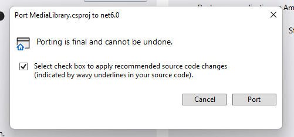

# Porting your application
Once your assessment has been completed, you are able to port your project to the desired vbersion of .NET. 

## Warning:
Porting applciation code is destructive. You can't undo the changes once the pocess of porting your solution has begun. Before going down the path of porting your applciation code ensure that you have a backup copy of your source code. 

## Start porting your application

You start the porting process for your applciation from the assessment dashboard. The project to be ported in the Solution Explorer, then With the active project selected click the Port drop down, and thel click "Port selected project."

At this point you receive one final warning that the process is perminant.

Check the confirmation and then click the Port button. The time required for portin your application will vary depending on the size of the solution, number of projects, etc. Once porting has been completed, you will receive a message indicating thet porting has been successful.

Click Ok to dismiss this dialog. You will then receive a message that your project files have been updated. This dialog will give you the option to reload. You should click the button to "Reload All" before going any further.

Once your project has been reloaded, the dashboard will look like this.

This completes the porting of your applciation. However if you attempt to run the applciation now, you will notice that the applciation does not compile. You will need to move onto the manual refactoring stage in order to complete the move to .NET 6. 

